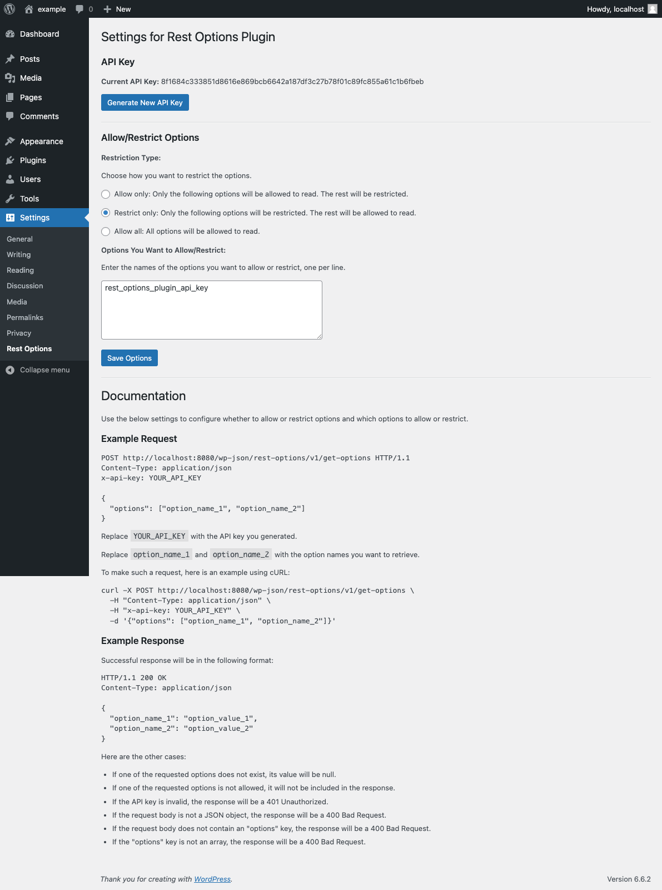

# WP Rest Options Plugin
This plugin adds a REST API endpoint to read WordPress options.

## Features
- Read WordPress options via REST API.
- Secure access with an API key.
- Choose a rule to restrict/allow access to specific options.
- Batch read multiple options in a single request.

## Requirements
- WordPress 4.4 or later.
- PHP 5.6 or later.

## Installation
1. Download the plugin from the [releases page](https://github.com/gencoglutugrul/wp-rest-options/releases).
2. Upload the plugin to your WordPress site.
3. Activate the plugin.
4. Go to `Settings > Rest Options` to configure the plugin.
5. Generate an API key.
6. Choose a rule to restrict/allow access to specific options.
7. Ready to use!

## Usage
Send a POST request to `https://your-site.com/wp-json/rest-options/v1/options` with the following headers:
- `Content-Type: application/json`
- `X-Api-Key: YOUR_API_KEY`

The body of the request should be a JSON object with the following properties:
- `options`: An array of option names to read.

Example request:
```http
POST /wp-json/rest-options/v1/options HTTP/1.1
Host: your-site.com
Content-Type: application/json
X-Api-Key: YOUR_API_KEY

{
    "options": ["blogname", "blogdescription"]
}
```

Example Request with cURL:
```bash
curl -X POST https://your-site.com/wp-json/rest-options/v1/options \
    -H "Content-Type: application/json"
    -H "X-Api-Key: YOUR_API_KEY" \
    -d '{"options": ["blogname", "blogdescription"]}'
```

Example response:
```json
{
    "code": "success",
    "message": "Options retrieved successfully.",
    "data": {
        "status": 200,
        "options": {
            "blogname": "My Blog",
            "blogdescription": "Just another WordPress site"
        }
    }
}
```

## Allow/Restrict Rules
You can choose a rule to restrict/allow access to specific options. The available rules are:
- `Allow All`: Allow access to all options.
- `Allow Only`: Allow access to the given options.
- `Restrict Only`: Restrict access to the given options.

## Screenshot


## License
This project is licensed under the GPLv2 License - see the [LICENSE](LICENSE) file for details.
```
